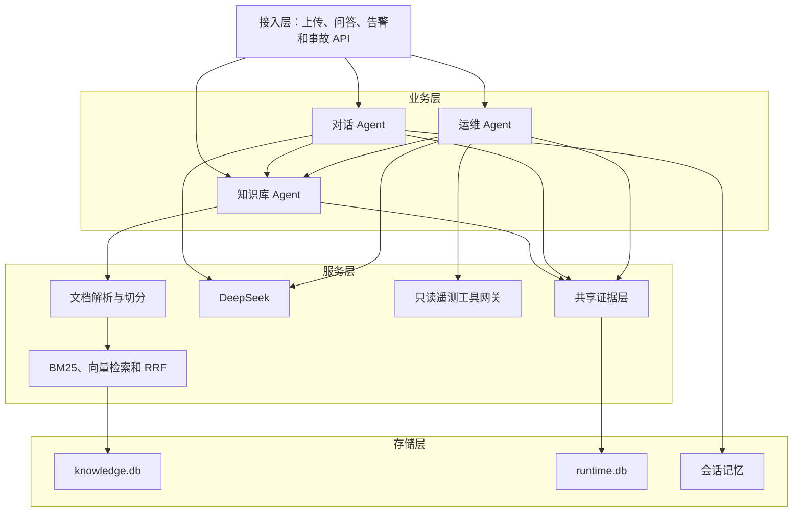

# OnCall Agent 三 Agent 架构说明

## 1. 项目定位

本项目包含三个核心 Agent：

1. **知识库 Agent**：负责文档处理和知识检索；
2. **对话 Agent**：使用检索增强生成（RAG）和受限 ReAct 完成带工具调用的问答；
3. **运维 Agent**：使用 Plan-Execute-Replan 自动规划并执行故障排查步骤。

三个 Agent 共用一个小型证据模块。该模块只负责统一来源、编号和引用校验，不负责推理、规划或执行。

告警去重、人工审批、处置演练、恢复验证和知识审核继续保留，但属于外围安全能力，不是第四个 Agent。

## 2. 四层结构



## 3. 知识库 Agent

### 文档准备

```text
上传 PDF、Markdown 或 TXT
→ 提取文本
→ 切分成片段
→ 保存文档和片段
→ 首次检索时建立向量
```

### 知识检索

```text
用户问题
→ BM25 关键词召回
→ 多语言向量召回
→ RRF 合并排名
→ 按来源可信程度调整顺序
→ 返回文档片段和来源
→ 转换成知识证据
```

当前没有运行独立向量数据库。文档和片段保存在 SQLite，向量索引在应用进程内按需建立。该实现适合公开演示和单实例部署。

对应代码：

- `app/agents/knowledge.py`：知识库 Agent；
- `app/knowledge.py`：文档处理、混合检索和会话记忆；
- `app/evidence.py`：把检索片段转换成共享证据。

## 4. 对话 Agent

对话 Agent 使用受限 ReAct：

```text
Reason：判断问题需要查询知识库
→ Action：调用 knowledge.retrieve
→ Observation：检查返回的知识证据
→ 必要时调整关键词并再检索一次
→ Final：DeepSeek 根据证据生成回答
→ 校验回答中的引用 ID
```

限制：

- 最多进行两次知识检索；
- 只能调用已经登记的知识工具；
- 不能执行 Shell 或生产写操作；
- 会话记忆只用于保持上下文，不能充当事实证据；
- 回答中引用不存在的证据 ID 会被标记并移除。

对应代码：`app/agents/conversation.py`。

## 5. 运维 Agent

### Planner

根据事故输入生成有界计划：

1. 读取事故输入；
2. 查询相关历史事故和处理手册；
3. 在企业工具网关可用时查询指标、日志、Trace 和近期变更；
4. 生成根因假设；
5. 校验证据引用。

### Executor

Executor 只能调用固定工具：

- `incident.read`；
- `knowledge.retrieve`；
- `telemetry.metrics.query`；
- `telemetry.logs.search`；
- `telemetry.traces.search`；
- `telemetry.changes.read`；
- `diagnosis.analyze`；
- `evidence.validate`。

### Replanner

每个步骤结束后检查结果：

- 首次知识检索没有命中时，扩大关键词范围；
- 诊断证据不足且尚未扩大检索时，补充检索并重新诊断；
- 最多调整两次计划；
- 一次调查最多执行八个计划步骤。

最终 `AgentRun` 保存计划、调整次数、工具调用、证据、假设和结论，可在前端回放。

对应代码：`app/agents/operations.py`。

## 6. 共享证据层

共享证据包含：

| 字段 | 作用 |
|---|---|
| `evidence_id` | 本次运行中的证据编号 |
| `source` | 日志、指标、文档或事故来源 |
| `statement` | 实际观察内容 |
| `evidence_type` | 事故报告、日志、指标、变更或知识片段 |
| `source_url` | 可以核对的原始地址 |
| `observed_at` | 观察时间 |
| `collected_by` | 产生该证据的 Agent |
| `content_hash` | 用于识别内容变化的摘要 |

它执行两项规则：

1. 工具结果和知识片段必须先转换成证据，才能支持结论；
2. 模型引用的证据 ID 必须真实存在，否则进入限制说明或被移除。

对应代码：`app/evidence.py`。

## 7. 外围安全能力

以下功能保留在项目中，但不属于三个 Agent 的核心编排：

- 企业告警 Webhook 与重复告警合并；
- Runbook 匹配；
- 人工批准或拒绝；
- 处置成功、失败和回滚演练；
- 事故知识候选审核。

公开部署仍然使用 Dry Run，不会重启服务器、修改数据库或切换生产流量。

## 8. 与原版项目的关系

保留的核心思想：

- 知识库准备与检索；
- ReAct 工具问答；
- Plan-Execute-Replan 运维排查；
- API、业务、服务和存储四层结构。

主要调整：

- Milvus 改为 SQLite 加进程内混合索引，降低公开部署成本；
- Qwen 改为 DeepSeek；
- MCP 模拟工具改为固定只读企业工具网关契约；
- 增加共享证据格式与引用校验；
- 保留已有的安全演练页面，但不把演练表述为生产修复。

## 9. 当前边界

- 未配置企业工具网关时，运维 Agent 只能使用公开事故和知识库资料；
- 根因属于待验证假设，不是已经确认的生产事实；
- SQLite 和进程内会话不适合多实例企业部署；
- 当前 ReAct 和 Plan-Execute-Replan 都有固定工具集和最大循环次数；
- 进入生产前仍需要 SSO、RBAC、生产数据库、私网工具、审计和真实事故评测。

