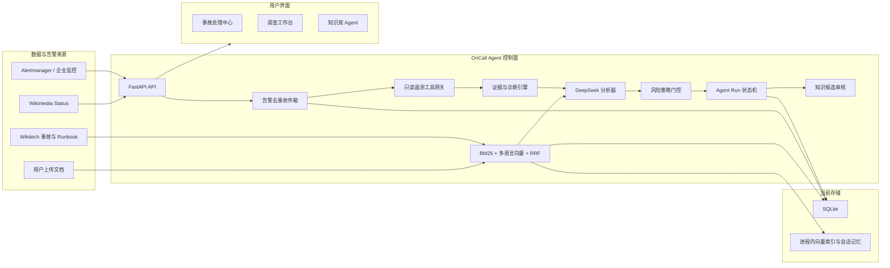
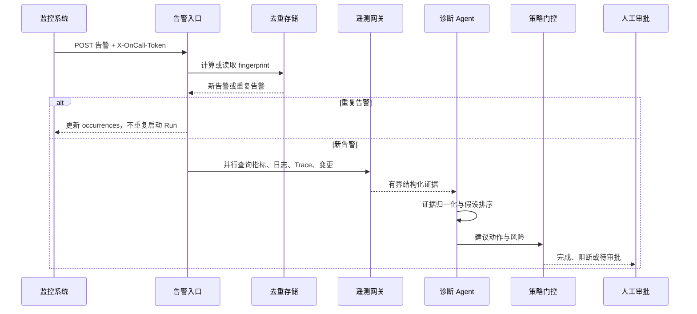

# OnCall Agent 项目技术说明书

> 文档用途：快速理解项目、准备技术面试、进行架构评审。  
> 适用版本：当前 `main` 分支公开演示版。  
> 重要边界：项目已经实现事故处理闭环的控制面和安全演练，但尚未获得任何企业生产系统写权限。

## 1. 一句话定义

OnCall Agent 是一个面向高频、标准化、低风险运维事故的智能处理系统：它接收告警，收集日志、指标、链路和变更证据，结合历史事故与 Runbook 生成可验证的根因假设，在策略和人工审批约束下执行安全演练，最后验证恢复结果并生成待审核复盘。

它不是普通聊天机器人，也不是允许大语言模型自由执行 Shell 的自动化脚本。

## 2. 项目解决的问题

传统值班流程通常包含以下重复工作：

1. 从监控平台接收大量重复告警；
2. 判断告警是否属于同一事故；
3. 在多个平台查询日志、指标、Trace 和近期变更；
4. 根据经验与 Runbook 判断可能根因；
5. 选择处置动作并评估风险；
6. 执行、验证、失败回滚；
7. 整理事故时间线和复盘材料。

项目将这些步骤建模为一个可观测、可审批、可回放的 Agent Run，核心目标是减少平均确认时间（Mean Time to Acknowledge, MTTA）和平均恢复时间（Mean Time to Recovery, MTTR），而不是无条件追求全自动化。

## 3. 项目定位与非目标

### 3.1 当前已实现

- Wikimedia 官方事故数据接入与离线快照降级；
- 企业告警 Webhook、确定性指纹和重复告警折叠；
- 固定的只读遥测工具网关契约；
- 证据规范化、根因假设排序和风险门控；
- DeepSeek 分析与本地确定性规则降级；
- 版本化 Runbook 匹配；
- 人工批准、拒绝和安全演练状态机；
- 恢复验证成功、失败回滚和人工升级分支；
- 事故知识候选生成与人工审核；
- 分层混合检索增强生成（Hybrid RAG）；
- PDF、Markdown、TXT 知识上传；
- 滚动摘要与近期原文结合的会话记忆；
- SQLite 运行记录、告警和上传知识持久化；
- GitHub Pages 前端与 Railway 后端部署；
- 自动化测试和 GitHub Actions 持续集成。

### 3.2 当前没有实现

- 企业单点登录（Single Sign-On, SSO）和基于角色的访问控制（RBAC）；
- Prometheus、Loki、Elasticsearch、Tempo、Jaeger 的真实企业适配器；
- Kubernetes、云平台、数据库的生产写执行器；
- 不可篡改的合规审计日志；
- 多副本数据库和分布式任务队列；
- 生产级密钥托管、双人审批和变更窗口；
- 经过企业历史事故评测的根因准确率；
- 无人值守的生产自动修复。

面试时必须区分“已经实现的安全演练闭环”和“生产化规划”。

## 4. 总体架构



### 4.1 为什么分成控制面与执行面

控制面负责调查、推理、审批和审计；执行面负责真正调用 Kubernetes、云平台或数据库。当前项目只实现控制面和内置安全演练连接器。

这样设计的原因：

- 大语言模型输出不应直接等同于生产命令；
- 执行权限必须由独立网关、RBAC 和允许列表限制；
- 控制面被攻击时，执行面仍能拒绝越权参数；
- 执行动作可以独立实现幂等、熔断、超时和回滚；
- 便于满足审计和职责分离要求。

## 5. 技术栈

| 层次 | 技术 | 选择原因 |
|---|---|---|
| 后端 | Python 3.12、FastAPI、Pydantic | 类型约束清晰，异步调用外部数据源方便，自动生成 OpenAPI |
| HTTP 客户端 | HTTPX | 支持异步、超时、Mock Transport 和连接错误处理 |
| 大模型 | DeepSeek Chat Completions API | 支持结构化 JSON 输出；未配置时可确定性降级 |
| 词法检索 | 自实现 BM25 | 精确匹配故障码、服务名、命令和英文缩写 |
| 语义检索 | FastEmbed、多语言 MiniLM | 中文提问可召回英文 Wikimedia 文档 |
| 融合排序 | Reciprocal Rank Fusion, RRF | 避免直接比较不同量纲的 BM25 与余弦相似度分数 |
| 文档解析 | pypdf、文本解码 | 支持 PDF、Markdown、TXT，不执行文档内代码 |
| 本地存储 | SQLite | 公开演示部署简单；生产需要迁移 PostgreSQL |
| 前端 | 原生 HTML、CSS、JavaScript SPA | 无构建依赖，GitHub Pages 可直接部署 |
| 容器 | Docker | 固定 Python 运行环境并预缓存嵌入模型 |
| 部署 | Railway、GitHub Pages | 快速展示后端和静态前端 |
| 测试 | pytest、GitHub Actions | 覆盖核心状态机、RAG、安全边界和 API |

## 6. 代码目录

```text
oncall-agent/
├─ app/
│  ├─ main.py             # FastAPI 入口、路由、中间件和依赖装配
│  ├─ models.py           # Pydantic 领域模型和枚举
│  ├─ alerts.py           # 告警持久化、指纹与去重
│  ├─ connectors.py       # 企业只读遥测工具网关
│  ├─ engine.py           # 确定性证据构建、规则诊断与风险建议
│  ├─ deepseek.py         # LLM 调用、结构化输出与安全策略
│  ├─ automation.py       # Runbook 选择、安全演练、知识候选
│  ├─ runtime.py          # Agent Run 状态机与 SQLite 持久化
│  ├─ statuspage.py       # Wikimedia Status 事故映射和降级
│  ├─ public_sources.py   # Wikimedia、官方组件资料和外部类比
│  ├─ knowledge.py        # 文档解析、分块、BM25、向量、RRF、记忆
│  └─ real_data.py        # 可验证的事故快照
├─ frontend/
│  ├─ index.html          # SPA 容器
│  ├─ app.js              # 路由、API 调用和页面渲染
│  ├─ styles.css          # 响应式布局和视觉样式
│  └─ config.js           # 公开后端地址，不包含密钥
├─ tests/                 # 自动化测试
├─ .github/workflows/     # CI 与 GitHub Pages
├─ Dockerfile
├─ railway.json
└─ README.md
```

## 7. 领域模型

### 7.1 事故输入

`IncidentRequest` 包含：

- 服务名与运行环境；
- 严重等级；
- 事故描述；
- 近期变更；
- 指标、日志、Trace、告警等结构化信号；
- 截断后的证据附件；
- 原始事故来源和事故 ID。

### 7.2 证据、假设和建议分离

- `Evidence`：已经观察到的事实，例如错误率、日志、状态页更新；
- `Hypothesis`：需要验证的根因解释；
- `Recommendation`：建议动作、风险等级、验证条件和回滚方案。

项目不允许把模型猜测直接写成“已确认根因”。假设必须引用证据 ID，并给出验证步骤。

### 7.3 Agent Run

`AgentRun` 聚合一次调查的完整状态：

- 输入事故与来源；
- 工具调用轨迹；
- 根因分析；
- 匹配的 Runbook；
- 审批记录；
- 演练执行结果；
- 恢复验证与回滚；
- 待审核知识候选；
- 创建和更新时间。

## 8. 端到端事故流程

### 8.1 企业告警流程



### 8.2 告警去重

如果上游提供 fingerprint，系统直接使用；否则对来源、环境、服务、标题和排序后的标签计算 SHA-256 截断值。

相同 fingerprint：

- 复用同一个 `event_id`；
- 增加 `occurrences`；
- 更新最新状态与内容；
- 不重复创建 Agent Run。

生产改造需要进一步增加去重时间窗口、告警分组和抑制规则。

### 8.3 八阶段 Agent Run

| 阶段 | 作用 | 当前是否写生产 |
|---|---|---|
| `statuspage.read` / `incident.input` | 读取事故 | 否 |
| `evidence.normalize` | 规范化证据 | 否 |
| `diagnosis.rank` | 排序可验证假设 | 否 |
| `citations.validate` | 校验引用 | 否 |
| `policy.gate` | 风险门控 | 否 |
| `runbook.execute` | 执行批准的 Runbook | 仅演练 |
| `remediation.validate` | 验证恢复条件 | 仅演练 |
| `knowledge.draft` | 生成复盘候选 | 写自身 SQLite，不发布正式知识 |

## 9. 根因分析设计

### 9.1 确定性降级路径

即使 DeepSeek 不可用，系统仍能：

1. 从事故描述、变更、信号和附件建立证据列表；
2. 用关键词规则计算匹配分数；
3. 生成最多三个根因假设；
4. 在证据不足时返回“无法形成可辩护根因”；
5. 给出需要补充的指标、日志和 Trace；
6. 将可执行建议标记为需要审批或阻断。

规则分数由关键词命中和独立证据数量组成。代码中的 `confidence` 是用于排序和界面展示的启发式分数，不是统计学概率，也没有经过企业故障数据校准。面试中不能把它称为“根因准确率”。

### 9.2 LLM 路径

LLM 接收经过限制的证据，并输出结构化字段：

- 假设标题；
- 置信度；
- 原因说明；
- 支持证据 ID；
- 验证步骤；
- 建议动作；
- 风险等级；
- 回滚方案。

服务端再执行安全策略：

- 引用不存在的证据会被拒绝或降级；
- 证据不足时不能建议生产写操作；
- 未知严重等级会进入阻断状态；
- 公开部署的动作必须经过审批；
- LLM 不直接访问执行凭据。

## 10. RAG 架构

### 10.1 为什么不是纯 BM25

BM25 适合：

- HTTP 5xx、OOMKilled、服务名、命令、告警名；
- 用户问题与文档使用相同专业术语；
- 需要精确解释匹配来源。

但中文问题可能需要召回英文事故，因此增加多语言向量通道。

### 10.2 为什么不是纯向量检索

纯向量检索容易弱化：

- 精确错误码；
- 版本号；
- 服务和组件名称；
- 命令参数；
- 短缩写。

因此系统采用 BM25 + 多语言语义检索。

### 10.3 分块

- 默认块大小约 900 字符；
- 重叠约 120 字符；
- 优先在换行和中文句号处截断；
- 避免关键上下文恰好跨越两个块；
- 单文件最大 5 MB；
- 提取文本最大 250,000 字符。

### 10.4 RRF 融合

BM25 与余弦相似度不在同一量纲，系统不直接相加原始分数，而采用倒数排名融合：

```text
RRFScore(d) = Σ channelWeight / (rankConstant + rank(d))
```

在此基础上再乘以：

- 数据源权威度；
- 查询意图对应的命名空间路由权重。

### 10.5 数据分层

| 命名空间 | 用途 | 默认权威度 | 可直接支持动作 |
|---|---|---:|---|
| `wikimedia_runbooks` | 标准排查与处置步骤 | 1.00 | 是，但仍需审批 |
| `wikimedia_incidents` | 历史事故与根因 | 1.00 / 0.85 | 否 |
| `wikimedia_status` | 当前和历史状态更新 | 高 | 否 |
| `upstream_official_docs` | Kubernetes、Prometheus、MariaDB | 0.70 | 否 |
| `external_postmortems` | 外部企业故障类比 | 0.30 | 否 |
| `user_uploads` | 用户上传的企业知识 | 查询时加权 | 取决于未来审核策略 |

动作类问题提高 Runbook 权重；历史类问题提高事故复盘和状态数据权重。外部企业事故不能越过权威边界直接生成生产动作。

### 10.6 RAG 与 Agentic RAG 的区别

当前是“固定来源、分层路由、权威重排的 Hybrid RAG”，不是开放式 Agentic RAG。

选择原因：

- 数据源可以审计；
- 网络访问范围固定，降低 SSRF 风险；
- 权威资料和类比资料不会混为一谈；
- 公开演示不具备企业 CMDB、日志和服务拓扑；
- 便于测试召回与引用。

接入企业环境后，可以让 Agent 根据服务类型选择日志、指标、Trace、CMDB 或 Runbook 工具，但工具集合仍应采用允许列表。

## 11. 会话上下文管理

系统采用分层上下文：

```text
历史长对话 → 滚动摘要
最近消息   → 保留原文
总上下文   → 字符硬预算剪切
```

默认策略：

- 最近 8 条消息保留原文；
- 更早消息压缩进不超过 2,400 字符的滚动摘要；
- 总上下文不超过 12,000 字符；
- 从最新消息向前装载，超过预算时停止；
- 摘要只用于对话连续性，不能替代知识证据。

该实现控制了上下文无限增长，但当前摘要是确定性压缩而非专门的事实记忆系统，会话也只保存在进程内存中。

## 12. Runbook、审批与回滚

### 12.1 Runbook 匹配

当前代码内置多个版本化 Runbook 定义，根据根因假设关键词进行确定性匹配。每个计划包含：

- Runbook ID 和版本；
- 风险等级；
- 执行模式；
- 分步动作；
- 哪些步骤需要写权限；
- 恢复验证条件；
- 回滚步骤。

### 12.2 为什么审批不是一个普通按钮

生产审批必须证明：

- 审批人的真实身份；
- 审批人是否具有目标资源权限；
- 审批时看到的计划版本；
- 参数是否在允许范围；
- 是否处于允许的变更窗口；
- 是否需要双人批准；
- 审批后计划有没有被修改。

当前公开版只记录用户填写的操作员名称，因此只能演示状态流转，不能作为生产授权。

### 12.3 当前执行

`execute_drill()` 只生成确定性的演练步骤和结果，不调用 Shell、Kubernetes 或云平台。失败分支会生成回滚演练记录并升级人工。

## 13. 存储设计

| 数据 | 当前位置 | 重启后 |
|---|---|---|
| Agent Run、审批、演练、知识候选 | `data/runtime.db` | 本地保留；Railway 取决于 Volume |
| 告警与去重状态 | `data/runtime.db` | 同上 |
| 上传文档文本与元数据 | `data/knowledge.db` | 同上 |
| BM25 与向量索引 | 进程内存 | 重新构建 |
| 会话记忆 | 进程内存 | 清空 |
| 外部事故与 Runbook 缓存 | 进程内存 | 重新同步 |

SQLite 适合演示和单实例，但不适合需要水平扩容、强审计和高可用的生产控制面。生产建议：

- PostgreSQL 保存事故、运行、审批和知识元数据；
- pgvector 或独立向量库保存嵌入；
- Redis 保存短期缓存、分布式限流和任务状态；
- 对象存储保存原始文档和审计附件；
- 消息队列承担异步调查与执行任务。

## 14. API 设计

### 14.1 主要接口

| 方法 | 路径 | 作用 |
|---|---|---|
| `GET` | `/api/scenarios` | 获取公开事故场景 |
| `POST` | `/api/analyze` | 分析脱敏事故 |
| `POST` | `/api/runs` | 创建 Agent Run |
| `GET` | `/api/runs/{id}` | 查看运行和审计轨迹 |
| `POST` | `/api/runs/{id}/decision` | 批准或拒绝 |
| `POST` | `/api/runs/{id}/execute` | 执行安全演练 |
| `POST` | `/api/runs/{id}/knowledge-review` | 审核知识候选 |
| `POST` | `/api/integrations/alerts` | 接收企业告警 |
| `POST` | `/api/knowledge/sync` | 同步公开知识源 |
| `POST` | `/api/knowledge/documents` | 上传知识文档 |
| `POST` | `/api/chat` | RAG 问答 |

### 14.2 可靠性处理

- 外部 HTTP 调用设置连接和总超时；
- 工具调用失败进入审计轨迹，调查降级继续；
- Wikimedia Status 失败时使用验证快照；
- Wikitech 同步失败时保留官方组件资料和外部低权重资料；
- 未配置 DeepSeek 时使用规则引擎；
- 告警重复通知不会重复创建运行；
- 运行和文档数量有上限；
- 上传文件有类型、大小和文本长度限制。

## 15. 安全设计

### 15.1 已有控制

- 外部数据源 URL 在服务端固定，用户不能提供任意抓取地址；
- 上传文档只提取文本，不执行其中代码；
- 外部文本后端清理 HTML，前端主要使用 `textContent`；
- API 密钥只存在服务端环境变量；
- CORS 仅允许本地开发地址和 GitHub Pages；
- 设置 `nosniff`、`DENY` Frame、Referrer 和 Permissions Policy；
- 告警 Webhook 未配置 Token 时拒绝服务；
- 生产写动作在公开版中不存在；
- 生成知识必须人工审核。

### 15.2 生产阻塞项

- 决策、执行、运行查询和知识上传接口没有 SSO/RBAC；
- Webhook 使用静态 Token，没有 HMAC、时间戳和防重放；
- 内存限流不支持多实例；
- 审批者名称来自客户端，身份可伪造；
- SQLite 审计记录可以被修改；
- 工具网关只有 Bearer Token，缺少 mTLS 和细粒度授权；
- 缺少 Prompt Injection 专项防护和企业数据脱敏；
- 缺少依赖漏洞扫描、SAST、DAST、压力和故障注入测试。

因此当前只能作为公开演示或企业只读影子模式。

## 16. 前端页面

| 路由 | 用途 |
|---|---|
| `#landing` | 产品定位、能力、真实数据和架构 |
| `#home` | 四阶段事故处理中心 |
| `#/incidents/{key}` | 事故时间线和启动调查 |
| `#/runs/{id}` | 工具、证据、根因、Runbook、审批、验证和复盘 |
| `#/customer-service` | 知识上传、RAG 问答、引用和会话记忆 |

事故处理中心分为：待处理事故、Agent 调查、操作审批、已完成事故。公开事故默认显示 5 条，可展开完整列表，避免后续工作区被长列表推到页面底部。

## 17. 测试策略

当前 30 项自动化测试覆盖：

- 状态页事故映射、HTML 清理和快照降级；
- Wikimedia 事故状态过滤和 Runbook 同步；
- RAG 文档上传、BM25、语义召回、RRF 和权威度排序；
- 会话记忆；
- DeepSeek 结构化响应和危险建议阻断；
- 确定性诊断规则；
- 企业遥测网关成功与失败路径；
- 告警认证、去重和 Run 关联；
- 审批、演练、恢复、回滚和知识审核；
- FastAPI 端到端接口。

尚需增加：

- 真实企业事故离线评测集；
- 检索 Recall@K、MRR 和引用正确率；
- 根因 Top-1、Top-3 命中率；
- 幻觉和提示词注入测试；
- 并发、长时间运行和故障恢复；
- 执行器幂等与回滚集成测试；
- 浏览器端 E2E 和无障碍测试。

## 18. 部署

### 18.1 Railway

Docker 镜像：

1. 安装固定依赖；
2. 预缓存多语言嵌入模型；
3. 复制后端和前端；
4. 使用 Railway 注入的 `PORT` 启动 Uvicorn；
5. `/api/health` 作为健康检查。

### 18.2 GitHub Pages

GitHub Actions 将 `frontend/` 发布为静态 SPA。`config.js` 只保存公开 Railway 地址，不保存 API Key。

### 18.3 本地启动

```powershell
Copy-Item .env.example .env
./run.ps1
```

访问：

- 页面：`http://127.0.0.1:8000`
- OpenAPI：`http://127.0.0.1:8000/docs`
- 健康检查：`http://127.0.0.1:8000/api/health`

## 19. 生产化路线

### 阶段一：只读影子模式

- 接收真实告警；
- 查询真实日志、指标、Trace 和变更；
- Agent 给出假设和 Runbook；
- 人工仍在原平台执行；
- 对比 Agent 判断与最终复盘。

### 阶段二：人工批准、系统执行低风险动作

- 接入 SSO 和 RBAC；
- 独立私网执行网关；
- 只允许版本化、可逆、参数有界的动作；
- Canary 执行和自动恢复验证；
- 失败自动回滚；
- 高风险动作双人审批。

### 阶段三：有限自动闭环

只有同时满足低风险、Runbook 已审核、证据完整、参数在允许范围、回滚已验证和不存在冲突变更时，才允许免审批执行。

数据库变更、数据删除、权限修改、全局流量切换和大规模重启必须保留人工控制。

## 20. 项目亮点与真实不足

### 20.1 亮点

1. 把事故处理建模为有状态、可审计的闭环，而不是单轮问答；
2. 明确区分证据、假设、建议和执行；
3. 支持模型不可用时的确定性降级；
4. 通过命名空间和权威度约束 RAG 数据；
5. 外部事故只用于类比，不能直接产生生产操作；
6. Runbook、审批、恢复验证、回滚和知识审核相互分离；
7. 使用真实公开事故而不是随机 Mock 指标；
8. 公开部署明确保持 Dry Run，不夸大能力。

### 20.2 不足

1. 还没有真实企业遥测；
2. 诊断置信度没有校准；
3. 没有企业历史事故评测；
4. SQLite 和内存状态限制了高可用；
5. 鉴权与审批身份不满足生产要求；
6. 没有真实执行器；
7. 规则库和 Runbook 数量仍小；
8. 前端为原生 SPA，工程化程度低于大型前端项目。

## 21. 面试时的正确项目总结

推荐表述：

> 我实现了一个证据约束型 OnCall Agent 原型。它能接收和去重告警，通过固定只读网关聚合遥测数据，使用规则引擎与大语言模型生成可验证的根因假设，再通过版本化 Runbook、风险门控、人工审批、恢复验证、回滚和知识审核形成闭环。知识问答采用 BM25、多语言向量和 RRF 的分层 Hybrid RAG。公开部署只执行 Dry Run，我没有把模型建议直接连接到生产写权限；生产化还需要 SSO/RBAC、PostgreSQL、私网执行网关和不可篡改审计。

不推荐表述：

> 这个系统已经可以完全取代运维人员并自动修复所有线上故障。

后者与当前代码事实不符，也会引出无法回答的安全性、准确率和生产案例追问。

## 22. 参考资料

- [DeepSeek API 模型与价格](https://api-docs.deepseek.com/zh-cn/quick_start/pricing)
- [Prometheus Alertmanager 集成](https://prometheus.io/docs/alerting/latest/integrations/)
- [OpenTelemetry Collector](https://opentelemetry.io/docs/collector/)
- [Railway Volume 参考](https://docs.railway.com/volumes/reference)
- [OWASP Top 10 for LLM Applications 2025](https://owasp.org/www-project-top-10-for-large-language-model-applications/assets/PDF/OWASP-Top-10-for-LLMs-v2025.pdf)
- [Wikimedia Status](https://www.wikimediastatus.net/)
- [Wikitech Incident Documentation](https://wikitech.wikimedia.org/wiki/Category:Incident_documentation)

